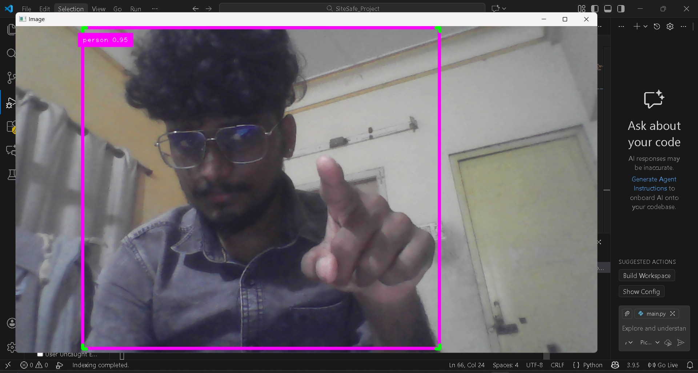

# SiteSafe: Real-Time Industrial Safety Detection 🚧


*(Note: Replace 'SiteSafe_Demo.jpg' with the actual name of your screenshot file)*

## 🔍 Project Overview
**SiteSafe** is a Computer Vision application designed to automate safety compliance in industrial environments. Using the **YOLOv8** architecture, it analyzes real-time video feeds to detect the presence of humans and potential safety violations (e.g., missing PPE).

Unlike standard detection models, this project is optimized for **CPU-based inference**, making it deployable on edge devices (like laptops or site cameras) without requiring heavy GPUs.

## 🛠️ Tech Stack
* **Model:** YOLOv8 (Nano) - Selected for high speed (30+ FPS) on standard hardware.
* **Vision Library:** OpenCV & CVZone.
* **Language:** Python 3.9+.

## 🚀 Key Features
* **Real-time Detection:** Processes video feeds instantly with low latency.
* **Confidence Filtering:** Eliminates false positives by setting dynamic confidence thresholds (>0.5).
* **Bounding Box Logic:** Custom logic to identify specific classes ('person') from the COCO dataset.

## 🔮 Future Scope (Work in Progress)
I am currently working on **Phase 2** of this project, which involves:
1.  **Fine-tuning** the YOLO model on a custom "Hard Hat & Safety Vest" dataset (via Roboflow).
2.  **Logic Integration:** Triggering an alert (Email/SMS) when a worker is detected *without* safety gear for more than 5 seconds.

## 💻 How to Run This
```bash
# 1. Clone the repository
git clone [https://github.com/YourUsername/SiteSafe-ComputerVision.git](https://github.com/YourUsername/SiteSafe-ComputerVision.git)

# 2. Install dependencies
pip install -r requirements.txt

# 3. Run the inference script
python main.py
